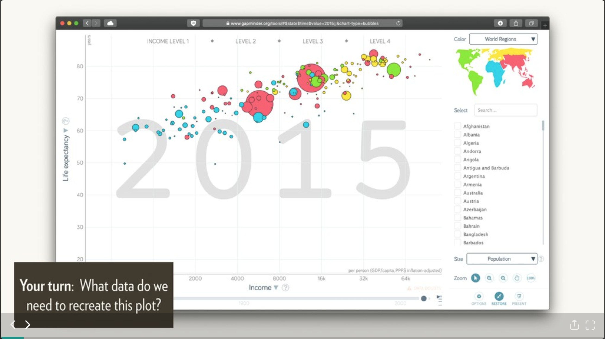

```{r setup, include=FALSE}
knitr::opts_chunk$set(echo = TRUE)
library(tidyverse)
```

## Background

On a recent twitter thread by [Hadley Wickham](https://twitter.com/hadleywickham) he posted his "Welcome to the
Tidyverse" slides:

<blockquote class="twitter-tweet" data-lang="en"><p lang="en" dir="ltr">Slides for my CSP keynote &quot;welcome to the tidyverse&quot; now up at <a href="https://t.co/f9DUxfPDoi">https://t.co/f9DUxfPDoi</a> <a href="https://twitter.com/hashtag/rstats?src=hash&amp;ref_src=twsrc%5Etfw">#rstats</a></p>&mdash; Hadley Wickham (@hadleywickham) <a href="https://twitter.com/hadleywickham/status/1096461439609511936?ref_src=twsrc%5Etfw">February 15, 2019</a></blockquote>
<script async src="https://platform.twitter.com/widgets.js" charset="utf-8"></script>

Most notably on the [third slide](https://speakerdeck.com/hadley/welcome-to-the-tidyverse?slide=3) he asked what it would take to reproduce the following chart



## Our Turn

Without peeking (promise!) we will try and produce the chart above
just knowing that the data can be found in the [`gapminder`](https://github.com/jennybc/gapminder) package. Let's do this!

### Step 1: Get the data

Firstly let's install the gapminder package since we don't have it yet `r emo::ji("open_mouth")`!

```{r, eval=FALSE}
install.packages("gapminder")
```

Let's select required columns from the `gapminder` dataset and 
rename them for convenience:

```{r get_data, cache=TRUE}
raw_gm <- gapminder::gapminder_unfiltered
trm_gm <- gapminder::gapminder %>% 
            dplyr::select(lifeExp, gdpPercap, continent, year, pop) %>% 
            dplyr::rename(life_exp = lifeExp,
                          income = gdpPercap) 
            # dplyr::mutate(region = dplyr::case_when(
            #     continent == "Oceania" ~ "Asia",
            #     TRUE ~ continent))
```

Now we are set! Let's get plotting

## Constructing the plot

```{r, cache=TRUE}
yr <- 2002
trm_gm %>% 
    dplyr::filter(year == yr) %>% 
    ggplot2::ggplot(data = ., aes(x = income, y = life_exp)) +
    ggplot2::geom_point(aes(fill = factor(continent), 
                            size = pop), shape = 21) +
    ggplot2::guides(fill=guide_legend(title="Region")) +
    ggplot2::ylim(20, 100) +
    ggplot2::scale_x_log10() +
    # scale_fill_viridis_d() +
    scale_size(range = c(1, 20), guide = FALSE) +
    ggplot2::theme_bw() +
    ggplot2::labs(title = stringr::str_c("Life Expectancy vs. Log(Income):", 
                                         yr, 
                                         sep = " "),
                  x = "Income (GDP per capita)",
                  y = "Life Expectancy")
```

